# Attention-based-Unet-for-segmentation
## Introduction
This project proposes a segmentation model based on a **U-Net architecture** improved by an **attention mechanism**. This architecture aims to improve the performance of image segmentation by allowing the model to focus on relevant regions while processing contextual details. In this project, we compare the performances between a classic U-Net and an attention based U-Net. The U-Nets of this project were trained to determine the liver, spleen and right/left kidneys on a database of 2D images of abdominal scanners.
## Prerequisites
Ensure you have the following dependencies installed:

- Python 3.8.10
- PyTorch
- NumPy
- scikit-learn
- Matplotlib
- Nibabel
- Skimage
  
To install the dependencies, run:

```
pip install -r requirements.txt
```


## U-Net architecture overview
U-Net is a convolutional neural network designed for **image segmentation**, especially in medical imaging. Its architecture is based on a **symmetric encoder-decoder structure**, with **skip connections** that link the encoder and decoder, helping the model retain both high-level features and fine-grained spatial information.

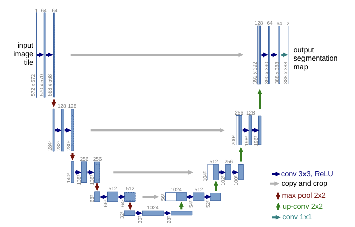

### Key features:
- **Encoder-Decoder structure**: The encoder reduces spatial dimensions, while the decoder upsamples to the original image size.
- **Skip connections** : These connections between encoder and decoder layers help preserve detailed spatial information.
- **Fully convolutional** : U-Net doesn’t use fully connected layers, making it efficient for images of different sizes.
- **Output** : A segmentation mask is produced where each pixel is assigned a class.
### Why U-Net works:
- **Efficient with small datasets**: Thanks to skip connections, U-Net can perform well even with limited data.
- **Highly accurate** : Combines both global context and local details for precise segmentation.
- **Flexible** : Originally designed for medical imaging, but works well for many other segmentation tasks.
### Applications:
- **Medical image segmentation**: Segmenting organs, tumors, etc.
- **Satellite image analysis** : Segmenting land features, water bodies, etc.
- **Autonomous driving** : Segmenting roads, pedestrians, vehicles, etc.
  
## Attention-based U-Net overview
The **Attention-based U-Net** enhances the traditional U-Net architecture by incorporating an **attention mechanism**, which allows the model to focus on relevant image regions while suppressing irrelevant ones. This leads to improved segmentation performance, particularly in complex images where precise localization is crucial.

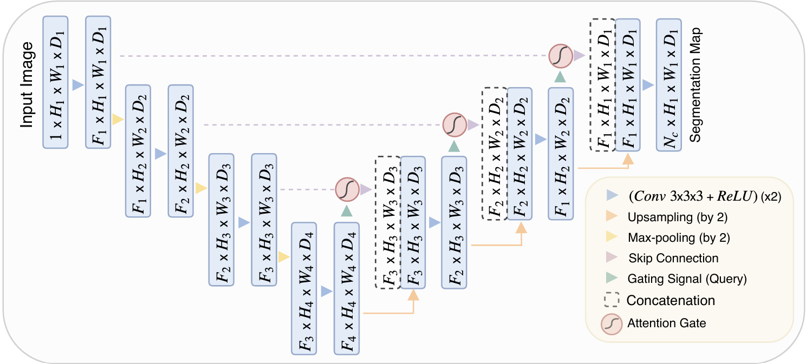

### Key features:
- **Attention mechanism** : Dynamically highlights important features, improving the model's ability to focus on key regions for more accurate segmentation.
- **Improved performance** : The attention mechanism helps the model perform better in scenarios with small datasets or complex structures, reducing the impact of irrelevant background noise.

### Why Attention-based U-Net works:
- **Better Focus on key features**: The attention mechanism allows the model to better capture important structures and details in the image, leading to more accurate segmentations.
- **Flexible and efficient** : Maintains the efficiency of U-Net while providing enhanced results in various domains, such as medical and satellite image segmentation.

## Usage
### Preparation 
In order to prepare the dataset, plese upload the [CHAOS-MRT2](https://chaos.grand-challenge.org/Data/) dataset in the same folder as the dataPrepare.ipynb file.
Then, run the dataPrepare.ipynb file.

### Training 
This model was trained on an abdominal image database which can be found [here](https://chaos.grand-challenge.org/Data/). However, this model can be trained on another medical or other imaging dataset.

To train both of the models (classic U-Net and augmented U-Net) with a custom dataset, use the following script:

```
python scripts/train.py --dataset_path ./data/train --epochs 50 --batch_size 8
```
#### Loss function
In order to understand our model, we have to establish the loss functions for both models.

For the first model we get this loss function : 

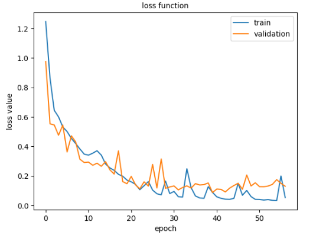

According to this graph, the training loss steadily decreases, indicating that the model is learning to better fit the training data.
The validation loss follows a similar trend at the beginning, with larger oscillations as the epochs progress.
From a certain point (around 20 to 30 epochs), the validation and training loss stabilizes around a low value, showing that the model reaches convergence.
Overall, this graph shows good behavior with training and validation loss decreasing, indicating that the model is learning efficiently without obvious overtraining.

For the second model we get this loss function : 
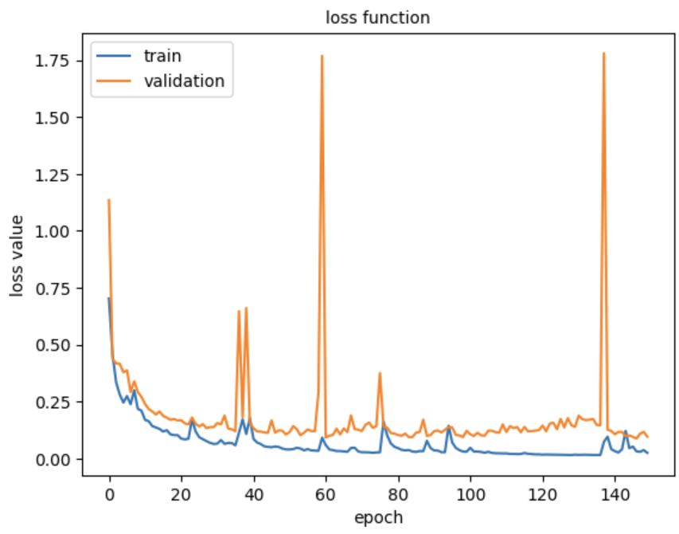
According to this graph, the training curve (blue) shows a gradual decrease in loss, which is expected when the model learns on the training data.
The validation curve (orange) is more unstable, with several sudden peaks and large oscillations but still converges.
The training loss is well controlled, but the validation loss shows some signs of variability.

### Evaluation
To evaluate the model on a dataset, use the following script:
```
python evaluation.py --model_path path_of_your_UNET_model's_.pt_file --model_path2 path_of_your_Augmented_UNET_model's_.pt_file --data_dir path_of_your_dataset's_folder --device ("cpu" or "cuda") --num_classes 5 --batch_size 8
```
the path of your dataset's folder has to be the path of your prepared dataset' folder in the case the CHAOS MRT2 Normalized 2D folder.

### Run it all
To run the whole project as a whole, you have two options.
1. if you have already trained the models, run the following code in your terminal:
```
python main.py --dataset_path ./data --load_classic path_of_your_classic_model's_.pt_file --load_aug  path_of_your_augmented_model's_.pt_file --device ("cpu" or "cuda")
```

2. Else, run the following code in your terminal:
```
python main.py --dataset_path ./data --train --epochs 50 --batch_size 8 --device ("cpu" or "cuda")
```

## Results
The performance of the Attention-based U-Net was compared to the standard U-Net version, showing a significant improvement in precision and recall metrics. Here is a table comparing the dice score of the two structures:

| Structure         | Class 0 (Background)  | Class 1 (Liver)  | Class 2 (Right Kidney)  | Class 3 (Left Kidney)  | Class 4 (Spleen)  | Overall Dice Score |
| ----------------- | -------- | -------- | -------- | -------- | -------- | ------------------ |
| UNet              | 0.9904   | 0.7217   | 0.5004   | 0.3693   | 0.4606   | 0.6118             |
| Augmented UNet    |  0.9908 | 0.8290 | 0.6133 | 0.6318 | 0.7015 | 0.7533 |

Here is some results of the both models : 
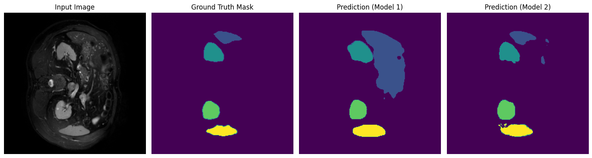

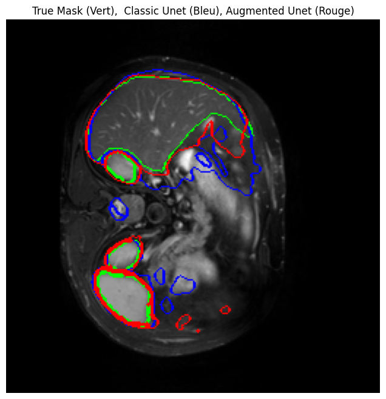

Moreover, here are predictions by organs for the unet model with attention gate : 

The Liver :
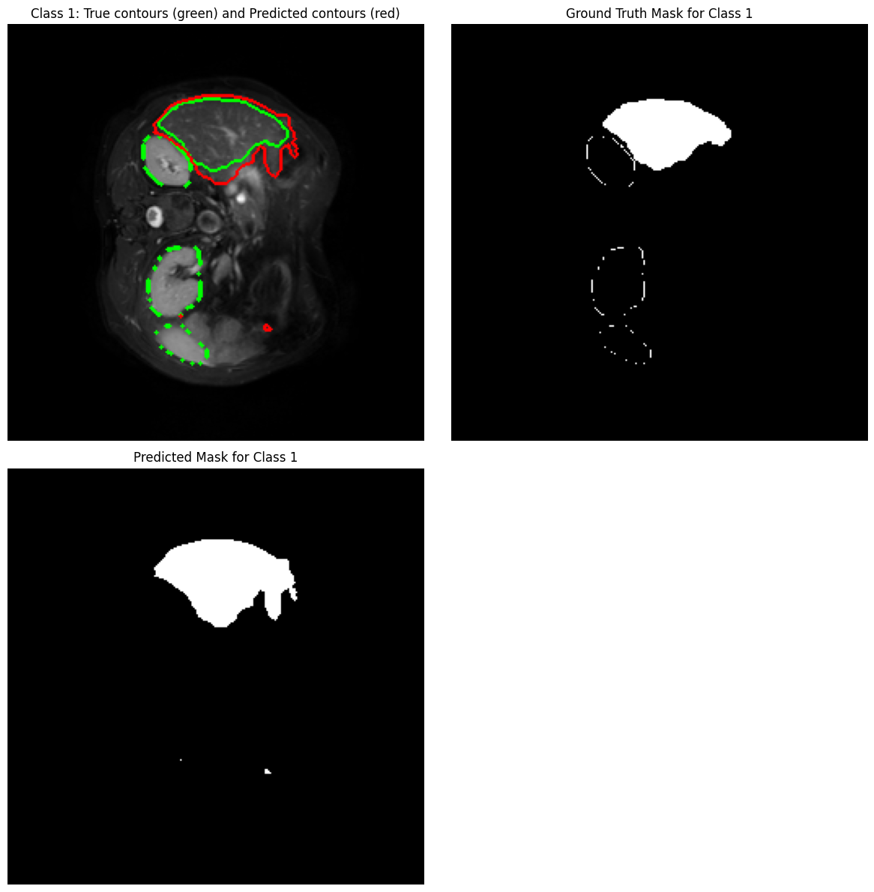
The Right Kidney : 
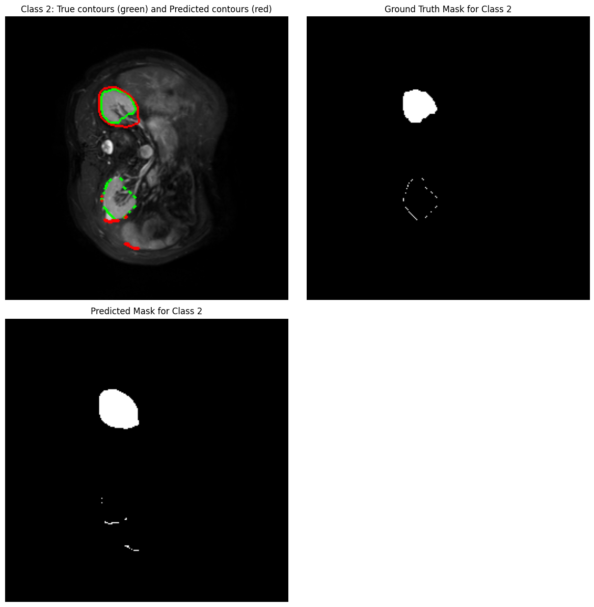
The Left Kidney : 
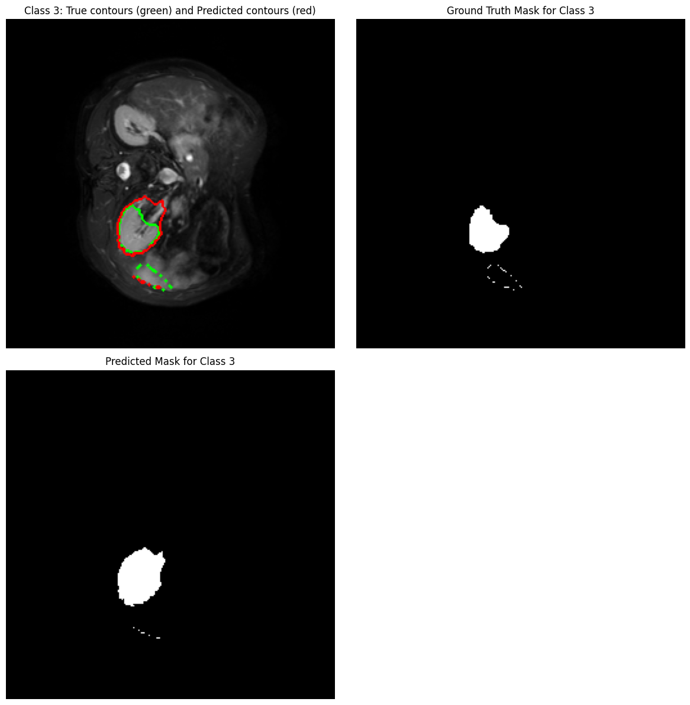
The Spleen : 
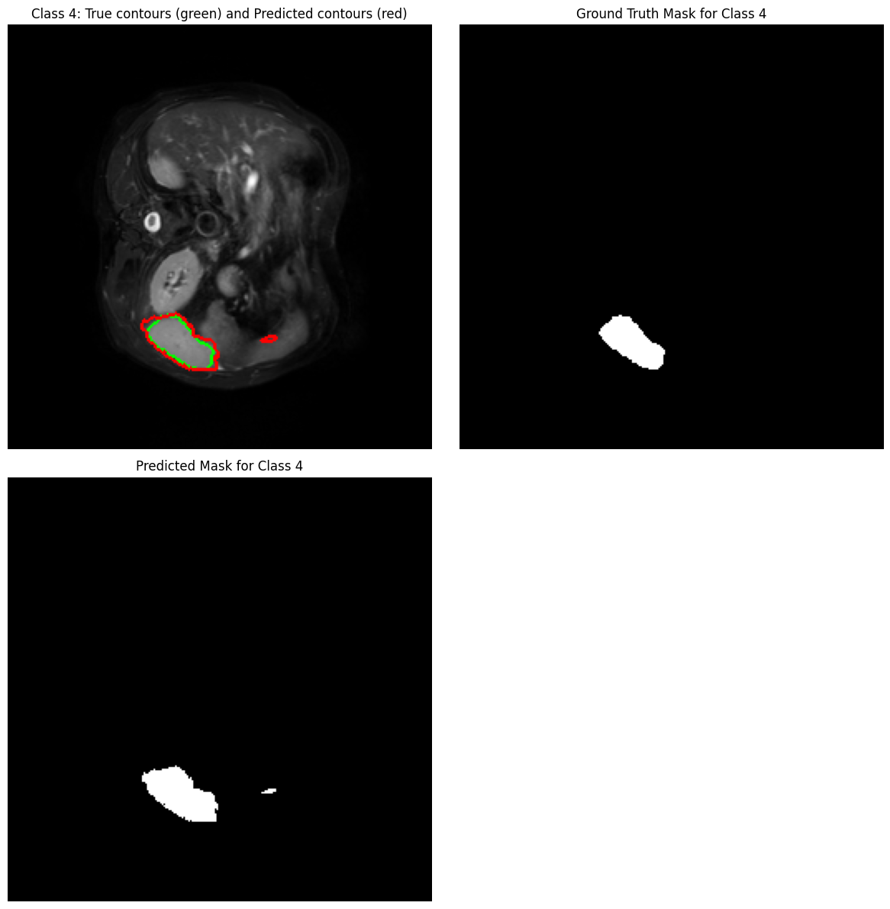

Finally we can visualize the attention map at the output of the attention gates for the augmented and trained UNET : 

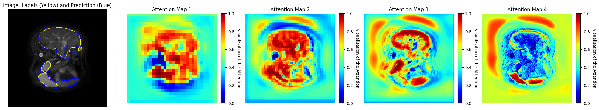

## Acknowledgements
This project was developed as part of the TAF Deep Learning course led and supervised by Pierre-Henri Conze at IMT Atlantique.

## Authors
Skander MAHJOUB, email : skander.mahjoub@imt-atlantique.net

Maria FLORENZA, email : maria.florenza-lamberti@imt-atlantique.net
